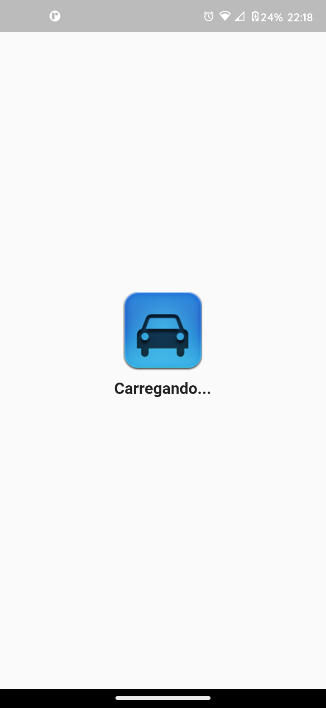
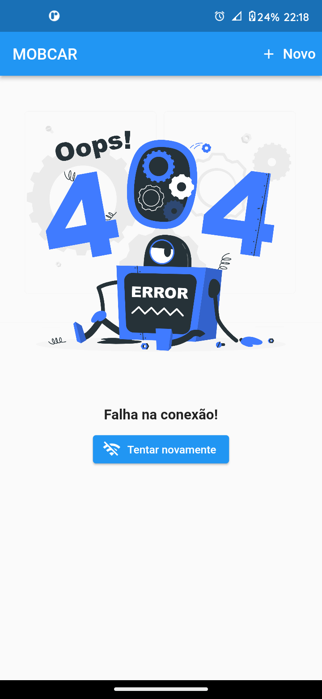

# mobicar

Desenvolvimento de uma aplicação mobile para obter requisições da internet da api FIPE: http://deividfortuna.github.io/fipe/

## Sobre o projeto

- Nesta aplicação foi implementado os fundamentos da arquitetura limpa (clean architecture) e S.O.L.I.D para organização das funcionalidades, utilizado gerenciamento de estado com GetX, utilizado HTTP para obter requisição, implementado banco de dados SQLite para criação do CRUD, implementado gerenciamento do fluxo da aplicação e controle asincrono.

## O que tem de novo
* Introduzido uma tela de carregamento inicial ao abrir o aplicativo (splash);

* Controle de conexão com a internet com connectivity_plus, caso o usuário fique offline, irá exibir uma página personalizada.

